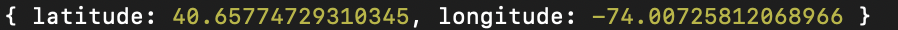

# family-promise-ds-api-demo
Demo code on how to implement Family Promise DS API. 

# How to get latitude and longitude back from /geocode/
1. In the root directory of the project, initialize a node application.
```
npm init -y
```
    - For those working off the family-promise-be repo, you can skip this step. 
2. Import the axios library into your project.
```
const axios = require("axios");
```
3. Create the address object you would like to get the latitude and longitude. 
```
// Sample address object using the address of the Empire State Building. 

{
    "address": "20 W 34th St",
    "address_line2": "",
    "city": "New York City",
    "state": "NY",
    "zip": "10001",
    "country": "United States"
}
```
4. Code an axios post request to http://family-promise-dev.us-east-1.elasticbeanstalk.com/geocode/. The post request takes 2 parameters:
    - URL to the DS API endpoint. 
    - Address object we created in the previous step.    
```
axios.post('http://family-promise-dev.us-east-1.elasticbeanstalk.com/geocode/', ({
    "address": "20 W 34th St",
    "address_line2": "",
    "city": "New York City",
    "state": "NY",
    "zip": "10001",
    "country": "United States"
  }))
```
5. Log your response and add error handling. 
```
axios.post('http://family-promise-dev.us-east-1.elasticbeanstalk.com/geocode/', ({
    "address": "20 W 34th St",
    "address_line2": "",
    "city": "New York City",
    "state": "NY",
    "zip": "10001",
    "country": "United States"
  }))
  .then( (res) => {
    console.log(res.data);
  })
  .catch((err) => {
    console.log(err);
  });
```
6. Run "npm start" on your terminal.



# Loom video on how to run this demo 

[Loom video on /geocode/](https://www.loom.com/share/c9cbc8b910b64009b945274bf4d7ac20)